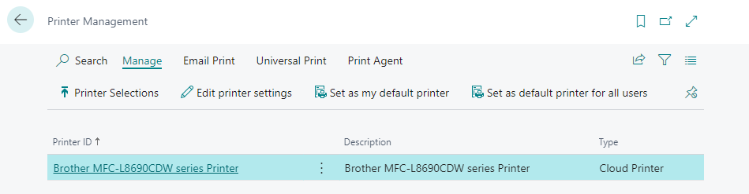

In dieser Kurzanleitung wird erklärt, wie Sie 365 business Print Agent aktivieren und einen Drucker einrichten.

> **Hinweis!** Testen Sie den 365 business Print Agent ohne Kosten in Sandbox-Umgebungen von Microsoft Dynamics 365 Business Central. Zusätzlich gibt es für Echt- und On-Premises-Umgebungen eine kostenlose 30-tägige Testphase ohne Funktionseinschränkungen.

## Voraussetzungen

 - Microsoft Dynamics 365 Business Central 2021 release wave 1 (18.0) oder neuer.
 - Ein Microsoft Windows-Clientgerät zur Ausführung von [365 business Print Agent Service](../print-agent-client-whatis).
 - Eine Internetverbindung

> **Hinweis!** Diese Kurzanleitung konzentriert sich auf den Print Agent Cloud Service Modus. Für weitere Informationen zur Einrichtung des Direct Connection Service Modus besuchen Sie bitte [documentation](../setup/).

## Schritt 1: Installation von 365 business Print Agent

Öffnen Sie den **Marketplace für Erweiterungen** in Microsoft Dynamics 365 Business Central und suchen Sie nach **365 business Print Agent**.
Installieren Sie die App von Microsoft AppSource und warten Sie, bis die Installation abgeschlossen ist.

## Schritt 1.1: Print Agent Einrichtung

  

Um den Print Agent einzurichten, öffnen Sie die Seite **Print Agent Einrichtung** in Microsoft Dynamics 365 Business Central,

 1. Wählen Sie **Print Agent Cloud** als **Dienstmodus**. [Mehr erfahren](../print-agent-whatis/#architecture)
 2. Wählen Sie **Print Agent authentifizieren**.
 3. Kopieren Sie den Wert **Tenant ID**  _(ohne geschweifte Klammern)_.
    > **Hinweis** Die Tenant ID wird verwendet, um den Print Agent-Dienst mit Ihrer Microsoft Dynamics 365 Business Central-Umgebung zu verknüpfen. Sie benötigen die Tenant ID später bei der Einrichtung des Print Agent-Dienstes.
 4. Wählen Sie **Software herunterladen...** um  [365 business Print Agent service](../print-agent-client-whatis/) herunterzuladen.

## Schritt 1.2: Installieren von 365 business Print Agent service

 1. Speichern Sie die heruntergeladene ZIP-Datei auf dem Server oder Computer, den Sie als _Druckserver_ mit 365 business Print Agent verwenden möchten.
 2. Entpacken Sie die ZIP-Datei (z.B. `C:\install`)
 3. Starten Sie die Setup Datei. [mehr erfahren](../print-agent-service-installation/)

## Schritt 1.3: Print Agent Service Einrichtung

 1. Starten Sie die **365 business Print Agent** Applikation.
 2. Wählen Sie **Konfigurieren**.
 3. Wählen Sie **365 business Print Agent Cloud (empfohlen)**.
 4. Kopieren Sie die **Tentant ID** aus Schritt 1.1.
 5. Bestimmen Sie einen **Namen** um den Client zu identifizieren.
 6. Wählen Sie **Übernehmen**, um die Einrichtung von 365 business Print Agent service abzuschließen.

## Schritt 2: Drucker einrichten

Um Drucker direkt in Microsoft Dynamics 365 Business Central einzurichten und zu verwenden, müssen Sie angeben, welche Drucker Sie für Microsoft Dynamics 365 Business Central freigeben möchten.

 1. Öffnen Sie die  **365 business Print Agent** Anwendung.
 2. Wählen Sie **Drucker** um alle verfügbaren Drucker auf dem Client anzuzeigen.
 3. Wählen Sie alle Drucker aus, die Sie für Microsoft Dynamics 365 Business Central freigeben möchten.
      

## Schritt 2.1: Freigegebene Drucker

 1. Microsoft Dynamics 365 Business Central öffnen.
 2. **Drucker** Seite öffnen.
 3. Wählen Sie **Freigegebene Drucker holen...**, um die freigegbenen Drucker zu holen
    

## Schritt 2.2: Aktivieren der Druckereinstellung

> **Hinweis!** Freigegebene Drucker sind in Microsoft Dynamics 365 Business Central nicht direkt verfügbar. Stattdessen ist es notwendig, [Druckereinstellungen](../printer-configuration/) zu erstellen., die dann in der **Druckerauswahhl** oder in der Report Request Page ausgewählt werden können. Sie können mehrere Druckereinstellungen auf der Grundlage der Funktionen erstellen, die Sie in einem bestimmten Szenario verwenden möchten (z. B. Duplex-Modus).  Für jeden Drucker wird automatisch eine vom System erstellte Druckereinstellung erstellt. Diese Konfiguration wird mit den verfügbaren Funktionen des Druckers erstellt.

 1. **Druckereinstellungen** auswählen.
 2. **Bearbeiten** auswählen.
 3. Überprüfen Sie, die vom System, erstellte Druckereinstellung
 4. **Aktiviert** auswählen um die Druckereinstellung zu aktivieren.

## Schritt 3: Druckereinstellungen zuweisen

Um die Möglichkeiten des Direktdrucks optimal nutzen zu können, ist es sinnvoll, einen Drucker (Konfiguration) für bestimmte Berichte oder Benutzer einzurichten. Die Konfiguration erfolgt in Microsoft Dynamics 365 Business Central auf der Standardseite **Druckerauswahl**.

 1. **Druckerauswahl** öffnen.  
 2. Wählen Sie eine **Benutzer-ID** aus oder lassen Sie das Feld leer, um den Drucker (Konfiguration) für jeden Benutzer zuzuweisen.
 3. Geben Sie eine **Berichts-ID** an oder lassen Sie diese leer, um den Drucker (Konfiguration) für jeden Bericht zuzuweisen.
 4. Wählen Sie den **Druckernamen** aus dem Dropdown-Menü aus.

> **Hinweis!!** Microsoft Dynamics 365 Business Central bietet eine zusätzliche Seite, **Druckerverwaltung**. Hier finden Sie alle in Print Agent aktivierten Drucker (Konfigurationen). Von hier aus können Sie die Druckereinstellung öffnen oder den ausgewählten Drucker (Konfiguration) als Standard festlegen. 

### Siehe auch

 - [Print Agent Architektur](../print-agent-whatis/#architecture)
 - [Was ist der Print Agent Service?](../print-agent-client-whatis/)
 - [Installation Print Agent Service](../print-agent-service-installation/)
 - [Print Agent Einrichtung](../setup/)
 - [Drucker](../printer/)
 - [Drucker Konfiguration](../printer-configuration/)
