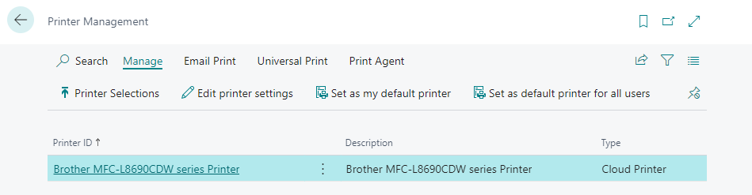

This quick start guide explains how to enable 365 business Print Agent and set up a printer.

> **Good to know** Explore 365 business Print Agent with no costs in Sandbox environments of Microsoft Dynamics 365 Business Central. Additionally for production and on-premises environments there is a free 30-days trial period with no feature limitations.

## Prerequisites

 - Microsoft Dynamics 365 Business Central 2021 release wave 1 (18.0) or later.
 - A Microsoft Windows client device for running [365 business Print Agent Service](../print-agent-client-whatis).
 - An internet connection.

> **Important** This quick start guide is focusing on Print Agent Cloud service mode. For additional information about set up Direct Connection service mode please visit [documentation](../setup/).

## Step 1: Install 365 business Print Agent

Open the **Extension Marketplace** in Microsoft Dynamics 365 Business Central and search for **365 business Print Agent**.
Install the app from Microsoft AppSource and wait until installation is completed.

## Step 1.1: Print Agent Setup

To set up Print Agent open the **Print Agent Setup** page in Microsoft Dynamics 365 Business Central,

 1. Select **Print Agent Cloud** as **Service Mode**. [Learn more](../print-agent-whatis/#architecture) 
 2. Select **Authenticate with Print Agent Service**.
 3. Copy the **Tenant ID** value by selecting the field value.
    > **Note** The Tenant ID is used to couple the Print Agent service with your Microsoft Dynamics 365 Business Central environment. You'll need the Tenant ID later in set up Print Agent service.
 4. Select **Download Service...** to download the latest version of [365 business Print Agent service](../print-agent-client-whatis/).

## Step 1.2: Install 365 business Print Agent service

 1. Save the downloaded ZIP-file to the server or computer you want to use as _print server_ with 365 business Print Agent.
 2. Extract the content of the ZIP-file (e.g. `C:\install`)
 3. Run the setup file. [Learn more](../print-agent-service-installation/)

## Step 1.3: Print Agent Service Setup

 1. Start the **365 business Print Agent** application.
 2. Select **Configuration**.
 3. Select **365 business Print Agent Cloud (recommended)**.
 4. Paste the Tenant ID copied in step 1.1.
 5. Specify a **Name** to identify the client device.
 6. Select **Apply** to complete your set up of your 365 business Print Agent service.

## Step 2: Set up printers

To set up and use printers directly in Microsoft Dynamics 365 Business Central you've to specify which printers, you want to share with Microsoft Dynamics 365 Business Central.

 1. Open **365 business Print Agent** application.
 2. Select **Printer** to view all available printers on your client device.
 3. Select each printer you want to share with Microsoft Dynamics 365 Business Central.
      

## Step 2.1: Get shared printers

 1. Open Microsoft Dynamics 365 Business Central.
 2. Open **Printers** page.
 3. Select **Get Shared Printer...** to retrieve the shared printers.
    

## Step 2.2: Enable Printer Configuration

> **Good to know** Shared printers are not directly available in Microsoft Dynamics 365 Business Central. Instead it's necessary to create [Printer Configurations](../printer-configuration/) which will be assigned in **Printer Selection** or selected in Report Request Page. You can create multiple printer configurations based on the capabilities you want to use in a specific scenario (e.g. duplex-mode).  For each printer a system-created printer configuration is automatically created. This configuration is created with the available features of the printer.

 1. Select **Printer Configurations**.
 2. Select **Edit**.
 3. Verify the system-created configuration.
 4. Select **Enabled** to activate the printer configuration.

## Step 3: Assign Printer Configuration

To get the most out of direct printing capabilities it's good to set up a printer (configuration) for specific reports or users. The configuration takes place in Microsoft Dynamics 365 Business Central standard page **Printer Selection**.

 1. Open **Print Selection**.
 2. Select **User ID** or leave blank to assign the printer (configuration) for every user.
 3. Specify **Report ID** or leave blank to assign the printer (configuration) for every report.
 4. Select **Printer Name** by choosing from the Drop-down menu.

> **Good to know** Microsoft Dynamics 365 Business Central provides a additional page, called **Printer Management**. Here you find every printer (configuration) enabled in Print Agent. From here you can easily open the printer configuration or set the selected printer (configuration) as default. 

### See also

 - [Print Agent Architecture](../print-agent-whatis/#architecture)
 - [What is the Print Agent Service?](../print-agent-client-whatis/)
 - [Installing Print Agent Service](../print-agent-service-installation/)
 - [Print Agent Setup](../setup/)
 - [Printer](../printer/)
 - [Printer Configuration](../printer-configuration/)
